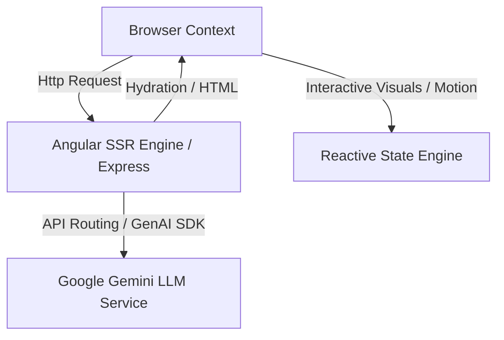

# BABYLONIAS.COM: The Digital Nexus of the BabylonIA Ecosystem


## 📖 Abstract

**BABYLONIAS.COM** is the official corporate platform and digital nexus of the BabylonIA agency. Engineered on Angular 21, Server-Side Rendering (SSR), and Tailwind CSS v4, the system represents the Escohotado-Kojève synthesis in client-facing consulting, technical intelligence, and digital sovereignty. It incorporates the Google GenAI SDK to drive intelligent web interactions and contextual routing.

---

## 🏛️ System Architecture

The repository implements a fully hydrated Angular Server-Side Rendered (SSR) engine backed by Express for static delivery, optimization, and real-time generation.



### Key Modules:
- **Consulting & Intelligence (`consulting`, `intelligence`)**: Interactive pages highlighting operational audit methodologies, LLM tool development, and data sanitization protocols.
- **Sovereignty (`sovereignty`)**: Dedicated interface demonstrating private server topologies and off-grid computing models.
- **Thesis (`thesis`)**: Interactive academic logs outlining the theoretical synthesis of Master-Slave automation and digital markets.
- **Client Dashboard (`hub`, `analytics`)**: High-end visualization metrics utilizing RxJS and Angular Material CDK.

---

## 🚀 Installation & Local Development

### Prerequisites:
- **Node.js** (v20 or higher)
- **NPM** or **Yarn**

### Setup:
1. Clone the repository and install dependencies:
   ```bash
   npm install
   ```
2. Run the development server:
   ```bash
   npm run start
   ```
3. Run with Gemini Integration (development mode):
   ```bash
   cross-env GEMINI_API_KEY="your_api_key" npm run dev
   ```
4. Build the production SSR bundle:
   ```bash
   npm run build
   ```

### Deployment Protocol:
The repository includes automated PowerShell deployment scripts for secure remote synchronizations:
- `deploy_recursive_public_html.ps1`: Deploys target assets to cPanel web directories.

Developed and deployed under the guidelines of the Actagen / Babylon.IA ecosystem.
